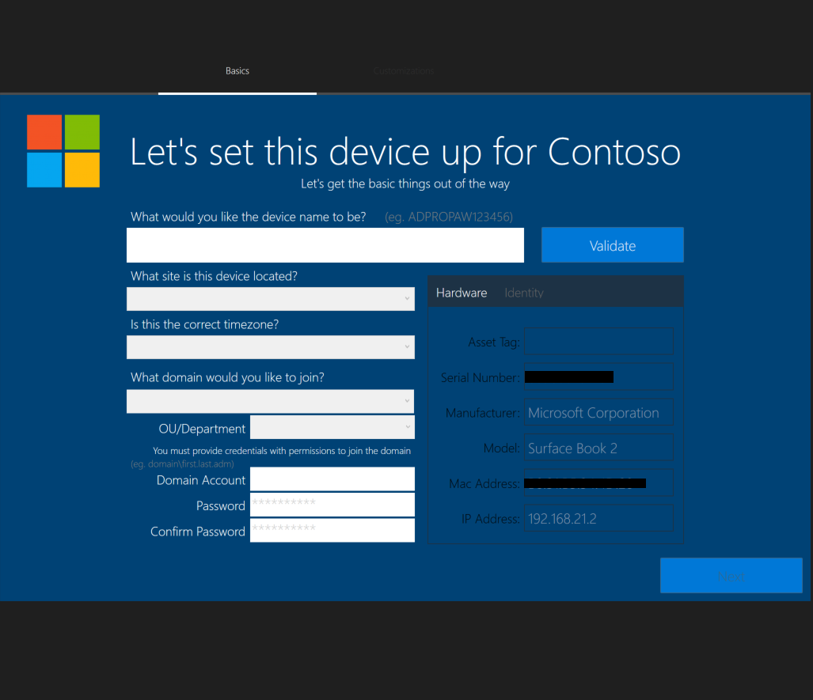
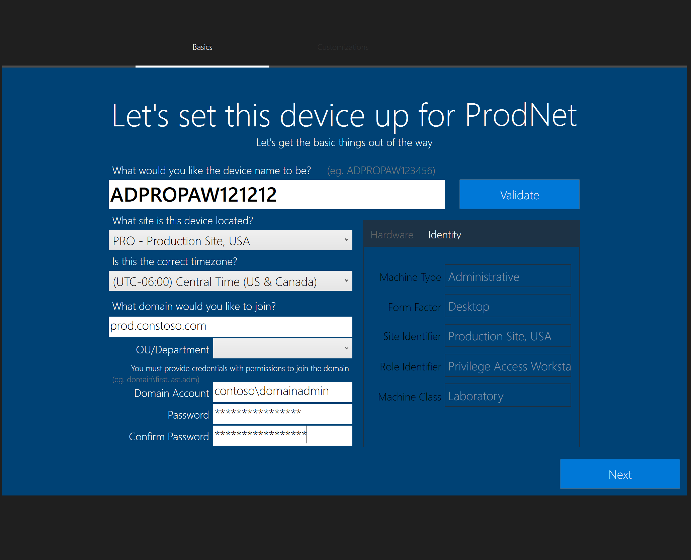
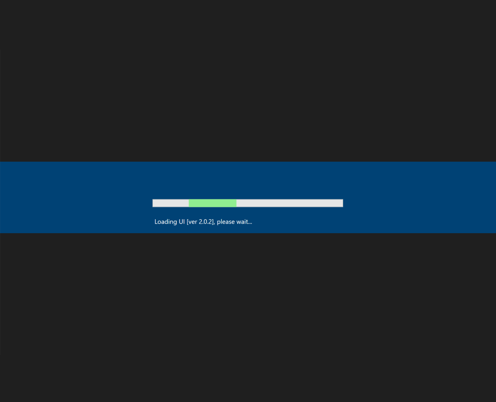
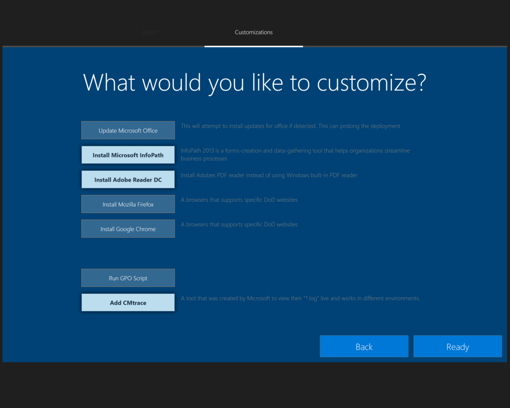
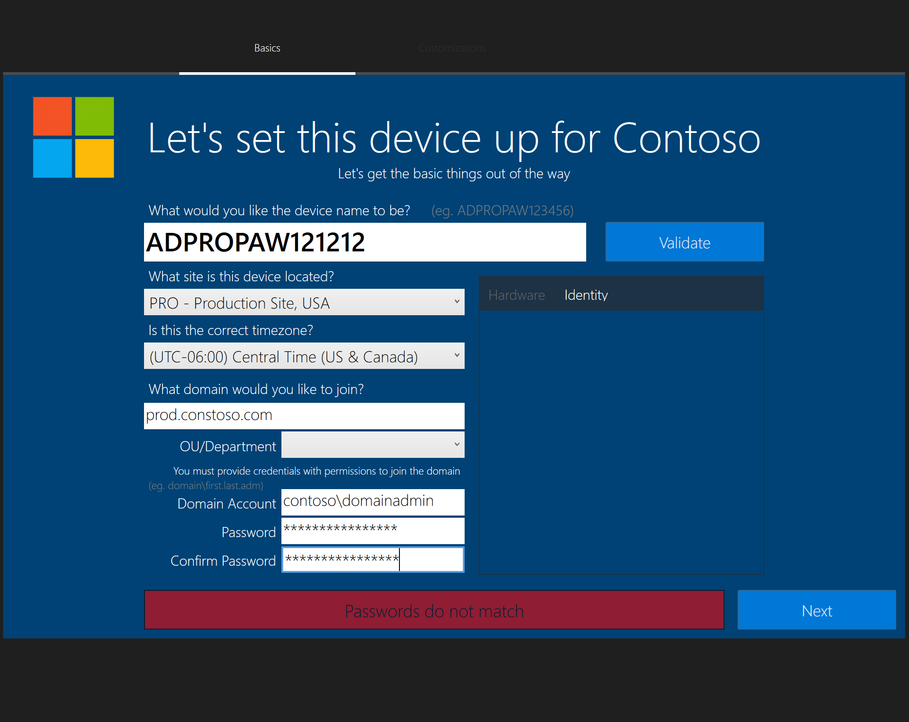
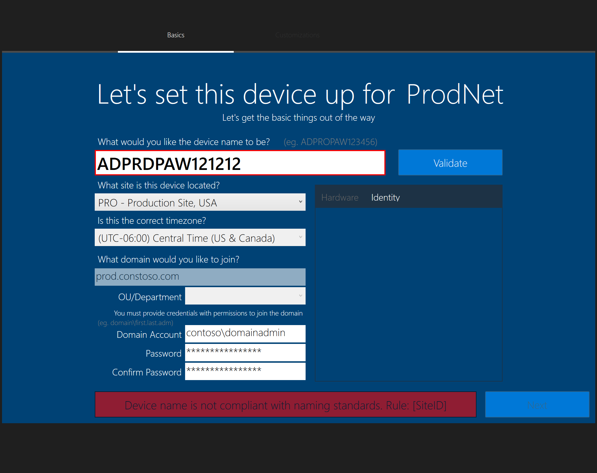

# OSDOOBEUI

An Out-of-the-Box Experience like user interface for Operating System Deployments

## Description

A PowerShell Driven UI that looks and feels like Windows 10 OOBE. Used in SCCM/MDT TaskSequence Bare-metal deployments

## Requirements

To support the UI in windows PE, these features must be installed:

- DISM Cmdlets
- Microsoft Data Access Component (MDAC/ADO) support
- Windows PowerShell

The recommended command to run the UI is:

#### **OSDOOBEUI.ps1**

Work-In-Progress
The UI is designed o look and feel like Windows 10 OOBE startup wizard but with more control

```bash
"%DEPLOYROOT%\tools\%architecture%\ServiceUI.exe" -process:TSProgressUI.exe "%SYSTEMROOT%\System32\WindowsPowerShell\v1.0\powershell.exe" -ExecutionPolicy Bypass -Sta -File "%SCRIPTROOT%\Custom\OSDOOBEUI\OSDOOBEUI.ps1"
```


#### **OSDOOBEUI_SinglePage.ps1**
 The UI is designed to be a single page with the option to add an additional app page if needed. The UI will look like this:
 
 
 

```bash
"%DEPLOYROOT%\tools\%architecture%\ServiceUI.exe" -process:TSProgressUI.exe "%SYSTEMROOT%\System32\WindowsPowerShell\v1.0\powershell.exe" -ExecutionPolicy Bypass -Sta -File "%SCRIPTROOT%\Custom\OSDOOBEUI\OSDOOBEUI_SinglePage.ps1" -ConfigPath OOBEUIWPF.config
```

### Current Features

- **Splash screen**: can be enabled or disabled by the config file. The splash screen is useful when hiding the PowerShell window screen while the UI is loading and task sequence progress bar


## Configurable Items

### Options Configuration

All settings are configurable within the **OSDOOBEUI.config** file

- **Logo1Position _[string]_**;   Changes the position of the logo in menu. Options: Left, Right, Both, Hidden; default is Left.
- **Logo2Position _[string]_**;   Changes the position of the logo in menu. Options: Left, Right, Both, Hidden; default is right
- **Logo1File _[string]_**;       Location where log file exists. (Recommend size is 100x100)
- **Logo2File _[string]_**;       Location where log file exists. (Recommend size is 100x100)
- **FormVariable _[string]_**;   Set the variable used for the Object sin XAML. No need to change
- **VerboseMode _[Boolean]_**;   Output verbose messages to PowerShell window
- **DebugMode _[Boolean]_**;     Output additional messages to PowerShell window
- **Test mode _[Boolean]_**;     Does not show the menu, just runs all functions and menu items
After menu is played/started, run these commands in PowerShell to trigger validation tests:

```powershell
        $OSDOOBEUI_txtComputerName.text = 'ADPROD12345PAW'
        $ComputerNameObject = $OSDOOBEUI_txtComputerName
        Validate-ComputerNameRules $ComputerNameObject
```

- **BackgroundColor _[string]_**;Changes the main background color of the UI
    **NOTE:** Buttons are not changeable. Recommend keeping background a blue tone

### Page Options

- **SinglePageOnly _[Boolean]_**;  Display the UI as a single page. App page can be enabled if set to true

When _SinglePageOnly_ is set to _false_ and apps are set


- **ShowAppSelection _[Boolean]_**; Display the App page (used for both single and multi page UI's)

### Control Configuration

- **[Still Testing] AutoGenerateName _[string]_**; Auto generates name based option selected _[AD, SQL or Locale, disabled]_. Using a SQL table and AD, name will be autogenerated and validated, Locale uses local config from network locale
- **[Still Testing] GenerateNameMethod _[string]_**; Auto generates name based option selected _[AD, SQL,ODJFile,ODJBlob,Locale,TSEnv,Clear].

- **[Still Testing] GenerateNameSource _[string]_**; Used only with ODJ set in GenerateNameMethod Property; specifies location to pull ODJ file. Path can be a local, network share, or a URL (Will use invoke method). ODJ file path will search for odj files that follow the naming format. Must be named: <assettag>_<serialnumber>_<computername>.odj. Using a SQL table and AD, name will be autogenerated and validated, Locale uses local config from network locale
  NOTE: ODJ set custom properties: ODJ_FilePath,ODJ_BlobData
- **OverWriteUIControlByTS _[Boolean]_**; Determines if tasksequence controls the UI vs Config (only changes UI_Control section)
                                                        TS variables needs to mirror control but with UI prefix added (eg. <Control_ShowSplashScreen>True</Control_ShowSplashScreen> -> UIControl_ShowSplashScreen=True)
- **ShowSplashScreen _[Boolean]_**;       Display splash screen prior to menu loaded. Hides verbose command window
- **ShowSiteCode _[Boolean]_**;           Displays site code. Site code can be changed is displayed
- **ShowSiteListSelection _[Boolean]_**;  Dropdown of all sites with site ID and site Code(if exists)
- **EnableNetworkDetection _[Boolean]_**; Select site locales based on current IP
- **ValidateNameRules _[Boolean]_**;      Uses Generation Rule Sets to ensure name is valid. Does not check if name is available on domain
- **ShowClassificationProperty _[string]_**; Displays classification property in Identity field with appropriate color based on device name (Values to choose from: Id,Level,Type,None)
- **ShowDomainOUListSelection _[Boolean]_**; Dropdown to select the OU to join to. Can be controlled by site locale
- **AllowCustomDomain _[Boolean]_**;      If enabled the domain field is a fillable textbox, if disabled the domain field is a dropdown (populated by Locale Domain Info)
- **AllowWorkgroupJoin _[Boolean]_**;     If set to false, the workgroup option is filtered out.
- **AllowSiteSelection _[Boolean]_**;     Enables the ability to change the Site ID from selection list (Must have ShowSiteListSelection enabled)
- **FilterAccountDomainType _[string]_**; Set this value to match a Locale Domain Type property. If set, the matching domain by classification will be filled in for the account domain
- **FilterDomainProperty _[string]_**;    Value is used when matching domain property to classification id property. Currently supports only classification id filter.
- **AllowRuleBypassModeKey _[string]_**;  If set, the validation rules can be bypassed by pressing shift before clicking validate. This allows custom names. Other validations are still checked
- **HideDomainList _[Boolean]_**;         If this is set to true, the domains fields will be hidden and no validation or variables will be set; overwrites ShowDomainOUListSelection
- **HideDomainCreds _[Boolean]_**;        If this is set to true, the credential fields will be hidden and no validation or variables will be set
    -->

### Generation Rules

This is highly configurable and can have up to 5 areas. This ultimately builds a regex string based on these settings. Please read the config file for more details

These section can be renamed. however keep the **ID** the same

- **IDMachineType _[table]_**; Value is controlled based computer name field (eg._**;A**DPROP12345PAW"_).

example:
```xml
<rulesets Id="Id1" Name="Machine Type" VarName="IDMachineType" MustExist="True" >
    <rule Char="A" Name="Administrative"                VarValue="Admin" />
    <rule Char="D" Name="Developer"                     VarValue="Developer" />
    <rule Char="R" Name="Training"                      VarValue="Training" />
</rulesets>
```

- **IDFormFactor _[table]_**; Value is controlled based computer name field (eg. _A**D**PROP12345PAW"_).

example:
```xml
<rulesets Id="Id2" Name="Form Factor" VarName="IDFormFactor" MustExist="True" >
    <rule Char="D" Name="Desktop"                       VarValue="Desktop" />
    <rule Char="H" Name="Virtual Desktop (VDI)"         VarValue="VDI" />
    <rule Char="L" Name="Laptop"                        VarValue="Laptop" />
    <rule Char="U" Name="Virtual Machine"               VarValue="VM" />
</rulesets>
```

- **SiteID _[stable]_**; Value is controlled based computer name field (eg. _AD**PROP**12345PAW"_).

example:
```xml
<rulesets Id="Id3" Name="Site Identifier" VarName="SiteID" MustExist="True" >
    <rule Name="Local Sites" GetVariable="MenuLocaleSiteList" MatchProperty="ID" DisplayProperty="BaseLocation" SetVariable="SiteID" />
</rulesets>
```

- **IDMachineClass _[table]_**; Value is controlled based computer name field (eg. _ALDTLAB**12**3456PA_). Value is determined by the first and/or second digits.

example:
```xml
<rulesets Id="Id5" Name="Machine Class" VarName="IDMachineClass" MinCharIdentifier="5" MustExist="True" >
    <rule Char="0#####" Name="Corporation"          VarValue="Corp" />
    <rule Char="1#####" Name="Laboratory"             VarValue="Lab" />
</rulesets>
```

- **IDMachineRole _[table]_**; Value is controlled based computer name field (eg. _ALDTLAB123456**PA**_). Value can be Null. Variable name can be changed in ruleset's _VarName_ property

example:
```xml
<rulesets Id="Id4" Name="Role Identifier" VarName="IDMachineRole" MustExist="True" >
    <rule Char="PAW" Name="Privilege Access Workstation"             VarValue="PAW" />
    <rule Char="SSW" Name="Security Access Workstation"              VarValue="SAW" />
    <rule Char="JMP" Name="Jump Box Workstation"                     VarValue="JMP" />
</rulesets>
```
### Classification list

If enabled, list is pre selected based on Computer Machine AS Rule; Searches for Type

example:
```xml
<Locale_Classifications>
	<classification Id="Prod" Level="Confidential"	Type="Confidential"	Color="Green"  />
	<classification Id="Lab" Level="Laboratory"    Type="Laboratory"	Color="Yellow"	/>
</Locale_Classifications>
```
### Domain List

Value is controlled based on dropdown field or by computer name value and when Validate is pressed. Not all options are present:

example:
```xml
<Locale_Domains>
	<domain Name="LABD" FQDN="lab.contoso.com"       ClassId="Lab" Type="Join" />
	<domain Name="PROD" FQDN="prod.contoso.com"       ClassId="Prod" Type="Join" />
	<domain Name="PROD" FQDN="prod.contoso.com"       ClassId="Prod" Type="Auth" />
</Locale_Domains>
```
### DomainOU List

If enabled, this list will poplulate a dropdown based on site selected

example:
```xml
<Locale_DomainOUs>
		<OU Name="Lab" Domain="LABD" LDAPOU="OU='Test',OU='lab',DC='contoso',DC=com"    ClassId="Lab" />
		<OU Name="Production" Domain="PROD" LDAPOU="OU='Systems',OU='Prod',DC='contoso',DC=com"    ClassId="Prod" />
</Locale_DomainOUs>
```

### Site List

Value is controlled based on dropdown field or by computer name value and when Validate is pressed. Not all options are present:

example:
```xml
<Locale_Sites DisplayFormat="&lt;id&gt; - &lt;Baselocation&gt;" SiteCodeFormat=" _[&lt;SiteCode&gt;]" >
    <site ID="LAB" BaseLocation="Laboratory Site, USA"  TZ="MST" Region="US" SiteCode="LAB" Domain="LABD" />
    <site ID="PRO" BaseLocation="Production Site, USA"  TZ="CST" Region="US" SiteCode="PRO" Domain="PROD" />
</Locale_Sites>
```

### NetworkDetection List

If enabled, it will match the IP subnet with the Site code and preselect the option in the UI

example:
```xml
<Locale_NetworkDetection>
    <Network SiteId="TEST" CidrAddr="192.168.1.0/24" />
    <Network SiteId="SITEB" CidrAddr="10.11.0.0/24" />
    <Network SiteId="SITEA" CidrAddr="10.21.0.0/24" />
</Locale_NetworkDetection>
```

### Applications

```xml
<Menu_AppButtons>
	<item id="1" Name="Update Microsoft Office"      TSvar="MSO13" DefaultEnabled="No" Desc='This will attempt to install updates for office if detected. This can prolong the deployment' />
    <item id="2" Name="Install Microsoft InfoPath"   TSvar="MSOIP" DefaultEnabled="Yes" Desc='InfoPath 2013 is a forms-creation and data-gathering tool that helps organizations streamline business processes' />
    <item id="3" Name="Install Adobe Reader DC"      TSvar="ADRDC" DefaultEnabled="No"  Desc='Install Adobes PDF reader instead of using Windows built-in PDF reader' />
	<item id="4" Name="Install Mozilla Firefox"      TSvar="MOZF" DefaultEnabled="No" Desc='A browsers that supports specific DoD websites' />
	<item id="5" Name="Install Google Chrome"        TSvar="GCE" DefaultEnabled="No" Desc='A browsers that supports specific DoD websites' />
	<item id="7" Name="Run GPO Script"               TSvar="SCRIPT1" DefaultEnabled="No" />
	<item id="8" Name="Add CMtrace"                  TSvar="SCRIPT2" DefaultEnabled="Yes" Desc='A tool that was created by Microsoft to view their "*.log" live and works in different environments.'/>
</Menu_AppButtons>
```

## OSD variables

If a task sequence is detected, the output will be a TS variable

- **OSDComputerName _[string]_**; value is what is in field
- **OSDNetworkJoinType _[0]_**; set only if domain name field is a string other than _workgroup_
- **OSDJoinType _[workgroup, domain]_**; set to _domain_ if domain field is a string other than _workgroup_
- **OSDDomainName _[string]_**; value is what is in field
- **OSDDomainOUName _[LDAP string]_**;
- **OSDJoinDomainOUName _[LDAP string]_**;
- **OSDJoinAccount _[string]_**;
- **OSDJoinDomainName _[string]_**;
- **OSDJoinPassword _[string]_**;
- **CMSiteCode _[string]_**; if enabled in configuration the site code is a 3 character string
- **TimeZone _[[integer]_**;
- **OSDTimeZone _[time zone]_**;
- **TimeZoneName _[time zone]_**;
- **OSDWorkgroupName _[workgroup]_**; only available when typing in _workgroup_ in the domain field
- **OSDJoinWorkgroupName _[workgroup]_**; only available when typing in _workgroup_ in the domain field
- **OSDLocalAdminPassword _[string]_**;
- **TimeZoneName _[string]_**;

Here are some screenshots or errors presented in UI

# Additional Screenshots




